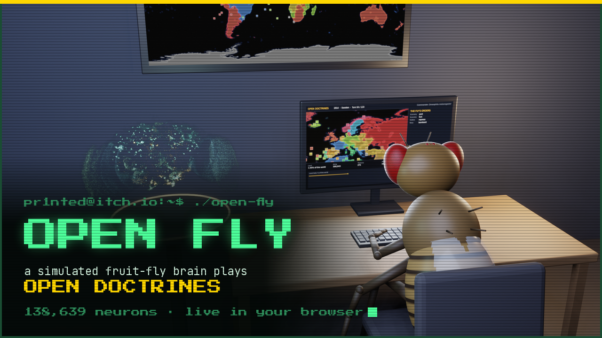

# Open Fly

**A simulated fruit-fly brain plays [Open Doctrines](https://github.com/Pr1nted/Open-Doctrines), live in your browser.**



The brain is the leaky integrate-and-fire model of the whole adult *Drosophila*
brain from Shiu et al. (2024), built on the FlyWire connectome: 138,639 neurons
and about 15 million synaptic connections. It runs in the page, in a worker, and
matches the original Brian2 model spike for spike. The game is Open Doctrines'
own engine compiled to WebAssembly and driven through its agent session. It uses
the same menu of actions and the same per-turn budget as the game's trained AI.

Each turn:

1. What happened to the country stimulates real sensory neurons. Land gained and
   a surplus are **sugar**; land lost, a deficit and new wars are **bitter**; the
   treasury is **water**; the number of wars drives the antenna's **Johnston's
   organ**.
2. The brain runs for 200 ms of simulated time.
3. Its 1,299 descending neurons, dealt into 39 action groups, choose the orders.

It is not a living fly, and nothing about it learned to play. How game events
reach the brain and how its output reaches the game is our design. It was written
down in [PREREGISTRATION.md](PREREGISTRATION.md) before the fly played.

**Watch it:** https://open-fly.pages.dev · https://pr1nted.itch.io/open-fly · [devlog](https://open-fly.pages.dev/devlog/)

## In short

- **One line:** A simulated fruit-fly brain plays Open Doctrines, live in your browser.
- **One paragraph:** Open Fly wires the FlyWire connectome of an adult fruit fly
  (138,639 neurons) into a strategy game. Every turn, gains and losses reach the
  brain as taste and touch, the brain runs for 200 ms, and its descending neurons
  give the orders. It is not trained and not good at it. You can watch it think,
  pick its map and country, and hand it your own.

## What the page does

- A 3D room with a free camera: the fly at the keyboard, the brain beside it with
  every spike drawn, the whole world on the wall and the fly's country on the monitor.
- Any map that ships with the game, or an `.odmap` you import. Any country, or a
  random one. A country that is wiped out restarts the same game with a new seed.
- It follows the game. Every Open Doctrines release rebuilds the page, has the fly
  play it, and posts a devlog (see [docs/releasing.md](docs/releasing.md)).

## Run it locally

```bash
tools/build_web_agent.sh ../OpenDoctrines          # web/agent: the game module (needs Emscripten)
python3 tools/export_web_brain.py --fly-data fly --out web/data   # web/data: the brain
python3 -m http.server 8767 --directory web
```

`fly/` needs `Completeness_783.csv` and `Connectivity_783.parquet` from
[philshiu/Drosophila_brain_model](https://github.com/philshiu/Drosophila_brain_model),
and `neuron_annotations.tsv` from
[flyconnectome/flywire_annotations](https://github.com/flyconnectome/flywire_annotations).
The release workflow fetches the same files.

To deploy: `tools/pack_web.py` splits the two large files into gzip parts under
Cloudflare Pages' 25 MiB limit. `tools/stage_web.py --out dist` copies what the
site serves. The page reassembles the parts and checks their SHA-256 before use.

`node tools/fly_run.mjs` plays one whole game headless, with the page's own brain
and game, and prints what the fly did.

The Python version, which plays the native server through a FIFO, is in
`open_fly/`. The Colab notebook `notebooks/open_fly_colab.ipynb` runs it with no
setup.

## Credits

- Brain model: Shiu et al., "A Drosophila computational brain model reveals
  sensorimotor processing", *Nature* 634, 210-219 (2024).
  [philshiu/Drosophila_brain_model](https://github.com/philshiu/Drosophila_brain_model), MIT.
- Connectome: Dorkenwald et al., "Neuronal wiring diagram of an adult brain",
  *Nature* 634, 124-138 (2024); Schlegel et al., "Whole-brain annotation and
  multi-connectome cell typing of *Drosophila*", *Nature* 634, 139-152 (2024).
  No FlyWire data is committed here. The website serves a copy derived from it.
- Game: Open Doctrines by Pr1nted.

Code is Apache 2.0. See [NOTICE](NOTICE).
